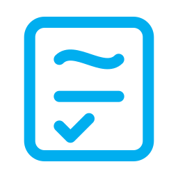
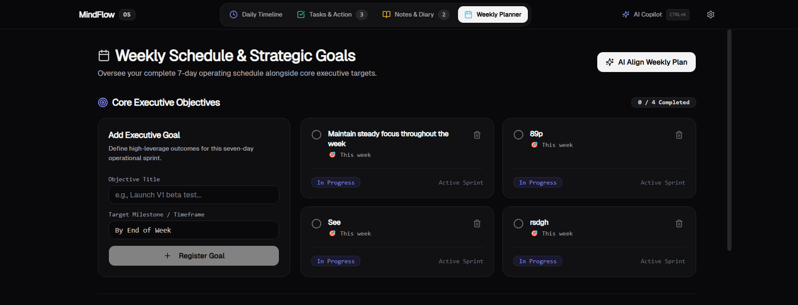
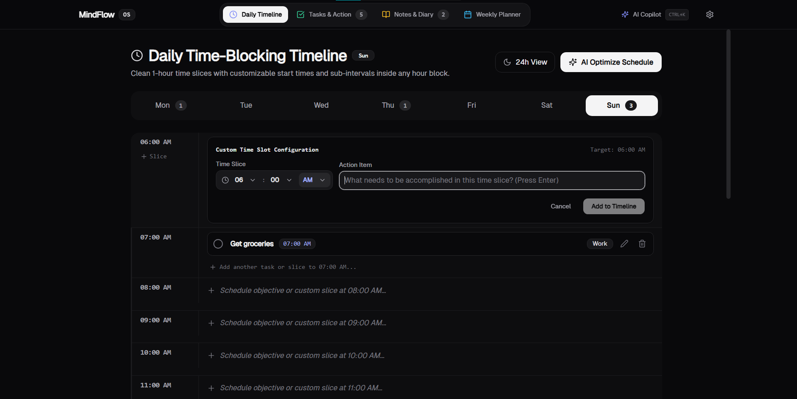
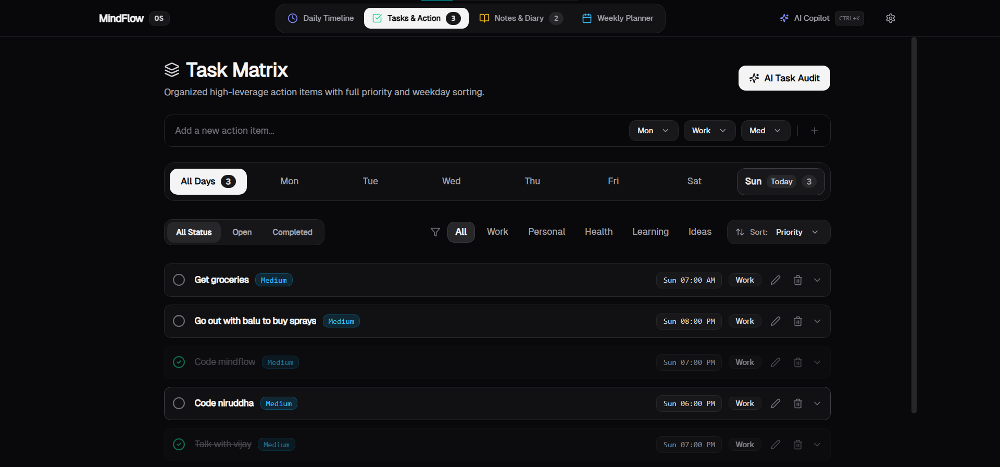
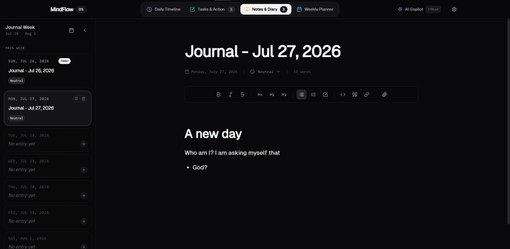

  
  <h1>MindFlow OS</h1>
  
A sleek, offline-first personal diary and task manager desktop application featuring an optional autonomous AI Copilot and secure local data storage.

  
<strong>Completely Free & Open-Source | 100% Private | Zero Telemetry | BYOK (Bring Your Own Key)</strong>

---

## 📥 Download & Install

You can download the standalone desktop application for your operating system below. These installers bundle everything you need—no coding knowledge required!

- [**Download for Windows (.exe)**](https://github.com/ThunderD9/mindflow/releases/latest/download/Mindflow-Setup-1.1.1.exe)
- [**Download for macOS (.dmg)**](https://github.com/ThunderD9/mindflow/releases/latest/download/Mindflow-1.1.1-arm64.dmg)
- [**Download for Linux (.AppImage)**](https://github.com/ThunderD9/mindflow/releases/latest/download/Mindflow-1.1.1.AppImage)

Alternatively, you can [**view the Releases page**](https://github.com/ThunderD9/mindflow/releases) to see all available versions, or download the raw source code (`.zip` and `.tar.gz`).

> [!WARNING]
> **Security Warnings during Installation**
> Because this is a free, open-source application without expensive corporate developer certificates, your operating system might initially block it.
> - **Windows (SmartScreen):** If your screen turns blue saying "Windows protected your PC", simply click **"More info"** and then **"Run anyway"**.
> - **Mac (Gatekeeper):** If Mac says the app is from an unidentified developer, go to your Applications folder, hold the `Control` key, **Right-Click** the app, and select **"Open"**.

---
## Features & Interface

### 1. Weekly Schedule & Strategic Goals
Oversee your complete 7-day operational schedule alongside core executive targets.

### 2. Daily Time-Blocking Timeline
Clean 1-hour time slices with customizable start times and sub-intervals inside any hour block.

### 3. Task Matrix
Organized high-leverage action items with full priority and weekday sorting.

### 4. Notes & Diary
A rich-text Markdown editor for journaling, with embedded link support, file attachments, and daily reflections.

## Getting Started

### Local Development
To run the app in development mode on your local machine:
1. Clone the repository
2. Install dependencies: `npm install`
3. Start the dev server: `npm run dev`

### Production Build & Server
To build the app for production and run it as a server:
1. Install dependencies: `npm install`
2. Build the project: `npm run build`
3. Preview the production build locally: `npm run preview`

*Note: The `dist` folder generated by `npm run build` can be hosted on any static site hosting platform like Vercel, Netlify, or GitHub Pages.*

## Data Storage & Backups

Mindflow OS is a completely **client-side application**. It does not use a backend database (like Postgres or MongoDB) and does not store files on a remote server. 

Where your data physically lives depends on how you run the application:

1. **Running as a Web Server (`npm run dev` or hosted on Vercel/Netlify):** 
   Your data (Tasks, Diary Entries, Goals, Settings) is stored securely within your **Web Browser's LocalStorage**. This means if you switch from Chrome to Safari, your data will not carry over automatically.
2. **Running as a Windows Desktop App (Electron `.exe`):**
   If packaged and installed as a standalone desktop application, the data is saved directly to your computer's hard drive inside the application's hidden AppData folder (specifically, as a Chromium LevelDB database in `%APPDATA%`).

### How to Backup & Migrate Data
Because the data is tied to your specific browser (e.g. Chrome, Edge), if you switch browsers, clear your cache, or want to move your data from the local development server to your final built application, you must use the built-in backup tool:

1. **Export:** Open the app, go to **Settings**, and click **"Save to Computer"**. This will download a single, comprehensive `mindflow-backup-*.json` file containing all of your data.
2. **Import:** To restore your data on a new device, a new browser, or after building the app, open the fresh app, go to **Settings**, click **"Restore Backup"**, and select your downloaded `.json` file. All your data will be instantly restored.
